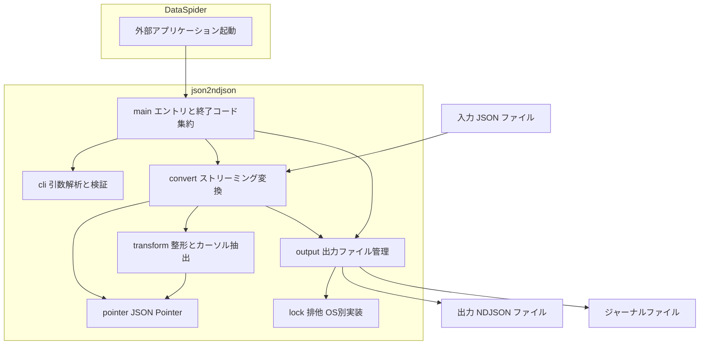
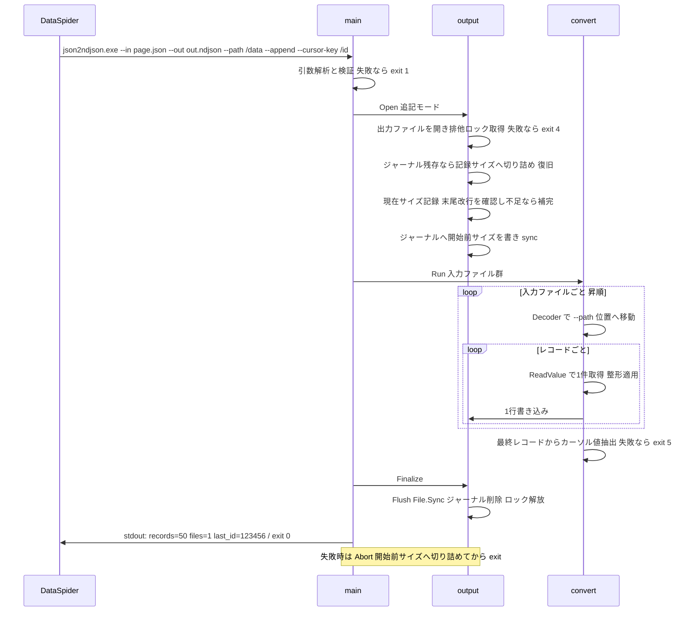
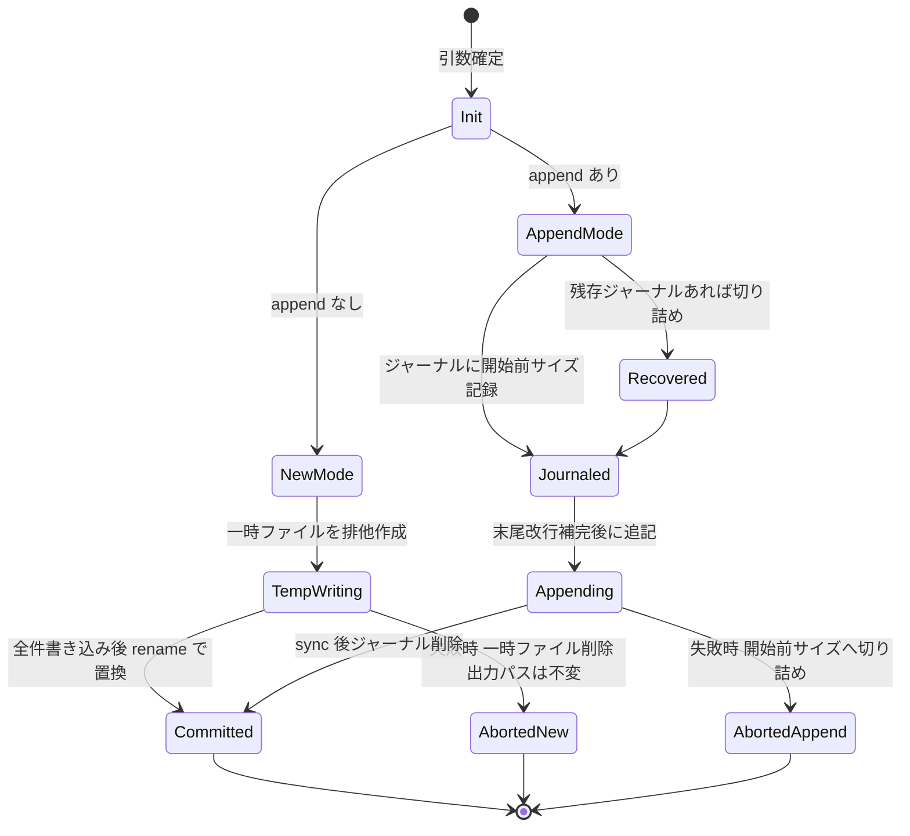

# Technical Design: json2ndjson

## Overview

**Purpose**: json2ndjson は、DataSpider Servista の [外部アプリケーション起動] 処理から同期的に呼び出される非対話型 CLI として、REST API レスポンスの JSON ファイルを NDJSON ファイルへストリーミング変換する。DataSpider スクリプトの開発・運用者は、生の JSON を一切解釈せずに、標準出力の結果行(`records`/`files`/`last_id`)だけでページングループを制御できる。

**Users**: DataSpider スクリプトの開発者がページごとの変換・追記(方式 A)のループ部品として利用し、運用者が終了コードと標準エラー出力で障害を切り分ける。

**Impact**: グリーンフィールド。リポジトリ直下に Go 1.27 の `main` パッケージを新規作成し、単一実行ファイル `json2ndjson.exe` としてクロスコンパイルして配布する。

### Goals

- RFC 8259 準拠の JSON ファイルを、入力サイズに依存しない一定メモリで NDJSON へ変換する(300 MB 入力を通常運用で処理)
- どの時点で失敗しても出力ファイルを「新規作成なら存在しない、追記なら追記開始前のサイズ」に復元する(強制終了後のジャーナル復旧を含む)
- 値の完全な無変換(数値の生字句保持、`\uXXXX` 非導入、ネスト保持)を保証する
- 終了コード体系(0〜5, 9)と結果行 1 行のみの標準出力で、呼び出し元の分岐・ループ制御を成立させる

### Non-Goals

- REST API からの取得(取得条件、ページング設定、HTTP エラー判定)— DataSpider 側の責務
- NDJSON の転送・ロード(BigQuery 等への投入)— 後続システムの責務
- エラー応答の内容による自動判定(FR-09 により明示的に非目標)
- ログファイルの出力、ネットワークアクセス
- DataSpider スクリプト本体の実装と結合テストの自動化(手順書で対応)

## Boundary Commitments

### This Spec Owns

- JSON → NDJSON 変換のすべて: JSON Pointer による変換対象位置の指定、ストリーミング読み取り、コンパクト出力、字句保持
- 出力ファイルのライフサイクル: 原子的新規作成、追記、ロールバック、ジャーナルによる強制終了後復旧、排他制御
- CLI 契約: 引数体系(6.7 節の全引数)、終了コード体系(0〜5, 9)、標準出力の結果行形式、標準エラー出力の規律
- 任意の整形機能: 重複排除、キー名置換、固定値追加、レコード長上限
- Windows 用単一 exe のビルド構成と、Windows 固有コード(ファイルロック)のビルドタグ分離

### Out of Boundary

- 入力 JSON ファイルの生成(REST アダプタの設定・保存)と、変換後の入力ファイルの削除(DS-15)
- 出力ファイルのループ開始前初期化(DS-16)— ツールは 1 回の実行の一貫性のみ保証する
- ページングのループ制御ロジックそのもの(DS-13, DS-14)— ツールは結果行を提供するのみ
- 受け側システムの行長上限・キー名制約の確定(Q-06)— 確定後に該当オプションの既定値へ反映する
- サーバーへの持ち込み承認・コード署名の手続き(Q-08)

### Allowed Dependencies

- Go 1.27 標準ライブラリ(中核は `encoding/json/jsontext`、ほか `flag`、`os`、`bufio` など)
- `golang.org/x/sys/windows` — Windows のファイルロック(`LockFileEx`)のみに使用。これ以外のサードパーティモジュールは追加しない(IMPL-02)
- 呼び出し規約としての DataSpider [外部アプリケーション起動] 処理の仕様(5.3 節)— 参照のみで、コード依存はない

### Revalidation Triggers

- 結果行の形式(`key=value` 空白区切り、`records`/`files`/`last_id`)の変更 → DataSpider スクリプトのループ制御の再検証が必要
- 終了コード体系の変更 → 呼び出し元のエラー分岐・通知の再検証が必要
- CLI 引数の名称・意味・排他関係の変更 → [外部アプリケーション起動] の引数リスト設定の再検証が必要
- ジャーナルファイルの名前・配置の変更 → 出力ディレクトリの運用(退避・削除手順)の再検証が必要
- Q-04(標準出力の文字コード)、Q-06(受け側制約)、Q-10(不正 UTF-8 の扱い)の決定 → 該当既定値と本設計の該当節を更新する

## Architecture

### Architecture Pattern & Boundary Map

単一バイナリの CLI パイプラインアーキテクチャを採用する。`main` パッケージ 1 つ(リポジトリ直下、IMPL-00)の中で、ファイル単位に責務を分離し、依存方向を一方向に固定する。



**Architecture Integration**:

- Selected pattern: 単一パッケージ・パイプライン(引数解析 → 出力準備 → 変換 → 確定)。ツール規模(推定 1,500〜2,500 行)に対して内部パッケージ分割は過剰と判断(synthesis: Simplification)
- Domain boundaries: 「変換の正しさ」(convert/pointer/transform)と「ファイルの安全性」(output/lock)を独立した縦割りにし、互いの内部状態に触れない。接点は `RecordWriter` 相当の書き込みインターフェース 1 本のみ
- Dependency direction: `pointer` → `transform` → `convert` → `output`(書き込み先として) → `main`。`cli` は `main` からのみ参照。逆方向の import は禁止
- Steering compliance: ステアリング未整備のため、要件定義書 12 章(IMPL/BUILD/TEST)を設計制約として直接参照する

### Technology Stack

| Layer | Choice / Version | Role in Feature | Notes |
|-------|------------------|-----------------|-------|
| 言語 / ランタイム | Go 1.27 系最新パッチ(go.mod の `go`/`toolchain` で固定) | 単一 exe、クロスコンパイル、CGO 無効 | IMPL-01, IMPL-03, BUILD-01 |
| JSON 処理 | 標準ライブラリ `encoding/json/jsontext`(Go 1.27 で既定有効) | ストリーミング読み取り(Decoder)、生字句保持(Value)、整形パスの再エンコード(Encoder) | IMPL-05〜08。API 検証記録は research.md |
| CLI | 標準ライブラリ `flag` | 二重ハイフン引数、`--in` 複数指定(`flag.Func`) | IMPL-18 |
| ファイルロック | `golang.org/x/sys/windows`(`LockFileEx`) | 出力ファイルの排他(非ブロッキング排他ロック) | IMPL-13。唯一のサードパーティ依存 |
| ビルド | `GOOS=windows GOARCH=amd64 CGO_ENABLED=0 go build -trimpath -ldflags "-s -w -X main.version=<タグ>"` | Windows 用単一 exe の生成 | BUILD-01。任意 OS でビルド可 |

## File Structure Plan

リポジトリ直下の `main` パッケージにファイル単位で責務を分離する(IMPL-00)。内部パッケージは作らない。

### Directory Structure

```
json2ndjson/
├── main.go              # エントリポイント。実行フロー統括、os.Exit の唯一の呼び出し箇所、結果行の出力
├── cli.go               # 引数解析(flag)→ Config 構造体。検証エラーは終了コード 1
├── errors.go            # ExitError 型(終了コード付き error)と終了コード定数(0〜5, 9)
├── pointer.go           # RFC 6901 JSON Pointer の解析(~0/~1、配列添字)。他ファイルに依存しない
├── convert.go           # ストリーミング変換コア。Decoder でポインタ位置へ移動し、レコードを 1 件ずつ処理
├── transform.go         # レコード単位の整形(dedupe、キー置換、add-field、サイズ上限)とカーソル値抽出
├── output.go            # 出力ファイル管理。新規(temp+rename)/追記(ジャーナル+truncate)、復旧、確定
├── lock_windows.go      # //go:build windows — LockFileEx による非ブロッキング排他ロック
├── lock_other.go        # //go:build !windows — no-op ロック(開発環境でのテスト用)
├── version.go           # version 変数(-ldflags で注入、既定 "dev")と --version/--help の表示文言
├── main_test.go         # E2E 相当: exe を模したプロセス内実行で終了コードと結果行を検証
├── pointer_test.go      # RFC 6901 準拠テスト
├── convert_test.go      # 変換の正しさ(9.1 節)・入力異常(9.2 節)のテーブル駆動テスト
├── transform_test.go    # 整形機能とカーソル抽出のテスト
├── output_test.go       # 追記・ロールバック・ジャーナル復旧・排他(9.3 節)のテスト
├── perf_test.go         # 300 MB 生成入力の時間・メモリ計測(TEST-02/03、testing.Short でスキップ)
├── testdata/            # 9.1/9.2 節の小さな JSON フィクスチャ
├── go.mod               # module 末尾 json2ndjson、go/toolchain 固定
└── go.sum               # golang.org/x/sys のみ
```

### Modified Files

なし(グリーンフィールド)。

## System Flows

### 実行全体のシーケンス(追記モード)



### 出力ファイルのライフサイクル(状態遷移)



フロー上の決定事項:

- ジャーナルは「追記の 1 バイト目を書く前」に sync 済みであることを保証する。これにより任意の時点の強制終了(タイムアウト中断を含む)後も、次回実行の冒頭で開始前サイズへ復旧できる(4.8)
- カーソル抽出の失敗(5.5)は Finalize 前に検出するため、FR-39 のロールバックが自動的に適用される
- 復旧(Recovered)はロック取得後にのみ行う。並行実行中の他プロセスのジャーナルを誤って処理することはない

## Requirements Traceability

| Requirement | Summary | Components | Interfaces | Flows |
|-------------|---------|------------|------------|-------|
| 1.1 | UTF-8/BOM 許容の JSON 入力 | convert | `runConversion` | — |
| 1.2 | 複数入力のファイル名昇順処理 | cli, convert | `Config.Inputs` | — |
| 1.3 | LF/CRLF 混在許容 | convert | Decoder 既定動作 | — |
| 1.4 | 入力の読み取り専用オープン | convert | `os.Open` 読み取り専用 | — |
| 1.5 | 入力不可→終了コード 2 | convert, errors | `ExitError{2}` | — |
| 1.6 | 構文不正→3 + 位置情報 | convert, errors | `ExitError{3}` + SyntacticError のバイトオフセットと JSON Pointer | — |
| 2.1 | JSON Pointer で位置指定 | pointer, convert | `ParsePointer`, `navigateTo` | シーケンス図 |
| 2.2 | 配列→各要素 1 レコード | convert | `emitArray` | シーケンス図 |
| 2.3 | オブジェクト→1 レコード | convert | `emitSingle` | — |
| 2.4 | 位置不正→5 | convert, errors | `ExitError{5}` | — |
| 2.5 | エラー応答の自動判定なし | convert | (2.4 の保険検出のみ) | — |
| 3.1, 3.2, 3.6, 3.7, 3.8, 3.9 | コンパクト・エスケープ維持・ネスト保持・字句無変換の出力 | convert | `writeRecord`(Compact 済み生 Value 直接書き) | — |
| 3.3, 3.5 | 改行コード選択・最終行改行の制御 | cli, output | `Config.Newline` / `Config.TrailingNewline` | — |
| 3.4 | 出力 UTF-8・BOM なし | output | BOM を書かない(生バイト透過) | — |
| 3.10 | 空配列→0 件正常終了 | convert, output | `records=0` + 空ファイル作成 | — |
| 4.1 | 絶対パス・空白/日本語対応 | cli, output | `Config.Out` | — |
| 4.2 | 新規作成の原子性 | output | temp+rename | 状態遷移図 |
| 4.3 | 追記/新規の自動判別 | output | `openAppend` | 状態遷移図 |
| 4.4 | 追記失敗時の切り詰め | output | `Abort` | 状態遷移図 |
| 4.5 | 末尾改行の補完 | output | `ensureTrailingNewline` | シーケンス図 |
| 4.6 | 同時実行の排他→4 | output, lock | `tryLock` | — |
| 4.7 | 既存ファイル+overwrite なし→4 | output | `openNew` | — |
| 4.8 | 強制終了後のジャーナル復旧 | output | `recoverFromJournal` | 状態遷移図 |
| 4.9 | 異常終了時の状態復元 | output, main | `Abort`(defer) | 状態遷移図 |
| 5.1, 5.2 | 結果行(records/files) | main | `formatResultLine` | — |
| 5.3, 5.4 | last_id の出力条件 | transform, main | `extract` + `formatResultLine` | — |
| 5.5 | カーソル位置不正→5 | transform, errors | `ExitError{5}` | シーケンス図 |
| 5.6 | 結果行 ASCII 限定 | main | `formatResultLine` 検証 | — |
| 6.1 | dedupe-key | transform | `Deduper` | — |
| 6.2 | キー名 `-`→`_` | transform | `rewriteRecord` | — |
| 6.3, 6.4 | add-field と衝突→1 | cli, transform | `rewriteRecord` | — |
| 6.5, 6.6 | max-record-bytes / skip-oversize | transform | `checkSize` | — |
| 7.1, 7.2 | 引数のみ設定・非対話 | cli | `flag` ベース解析 | — |
| 7.3 | 引数不正→1 | cli, errors | `ExitError{1}` | — |
| 7.4 | 終了コード体系 | errors, main | `ExitError` + `main` 集約 | — |
| 7.5, 7.6 | --version / --help | cli, version | `printVersion/printUsage` | — |
| 8.1, 8.2, 8.3 | stdout/stderr の規律 | main | 結果行は main 末尾で 1 回のみ | — |
| 9.1, 9.2 | ストリーミング・一定メモリ | convert | Decoder/ReadValue 逐次処理 | — |
| 9.3 | 300 MB 目標時間 | perf_test | `TestPerf300MB` | — |
| 9.4 | dedupe のメモリ文書化 | transform | `Deduper` 上限注記 | — |
| 10.1 | 冪等性 | convert, output | 決定的処理(乱数・時刻不使用) | — |
| 10.2 | 不正入力への耐性 | convert | 深さ上限 512 → 終了コード 3 | — |
| 11.1 | 単一 exe 配置 | go.mod, BUILD | BUILD-01 コマンド | — |
| 11.2 | ログレス(stdout/stderr/exit 集約) | main | — | — |
| 11.3 | ネットワーク非アクセス | 全体 | net 系 import 禁止 | — |
| 11.4 | 作業ディレクトリ非依存・一時ファイル配置 | output | temp/journal を出力と同一ディレクトリに作成 | — |

## Components and Interfaces

| Component | Domain/Layer | Intent | Req Coverage | Key Dependencies (P0/P1) | Contracts |
|-----------|--------------|--------|--------------|--------------------------|-----------|
| main | エントリ | 実行フロー統括・終了コード集約・結果行出力 | 4.9, 5.1–5.6, 7.4, 8.1–8.3, 11.2 | cli, convert, output (P0) | Service |
| cli | CLI | 引数解析・検証・Config 生成 | 1.2, 4.1, 6.3, 7.1–7.3, 7.5–7.6 | flag (P0) | Service |
| errors | 共通 | 終了コード付きエラー型 | 1.5–1.6, 2.4, 5.5, 7.3–7.4 | なし | Service |
| pointer | 変換 | RFC 6901 JSON Pointer の解析 | 2.1 | なし | Service |
| convert | 変換 | ストリーミング変換コア | 1.1–1.6, 2.1–2.5, 3.1–3.10, 9.1–9.2, 10.1–10.2 | jsontext (P0), pointer/transform/output (P0) | Service |
| transform | 変換 | レコード整形・カーソル/キー抽出 | 5.3–5.5, 6.1–6.6, 9.4 | jsontext, pointer (P0) | Service |
| output | ファイル | 出力ライフサイクル(原子性・追記・復旧・排他) | 3.10, 4.1–4.9, 11.4 | lock (P0), os/bufio (P0) | Service, State |
| lock | ファイル | OS 別の非ブロッキング排他ロック | 4.6 | x/sys/windows (P0, Windows のみ) | Service |
| version | CLI | バージョン埋め込みと表示 | 7.5–7.6 | なし | Service |

### 変換ドメイン

#### convert(ストリーミング変換コア)

| Field | Detail |
|-------|--------|
| Intent | 入力ファイル群を昇順に走査し、`--path` 位置のレコードを 1 件ずつ読み・整形し・書き出す |
| Requirements | 1.1–1.6, 2.1–2.5, 3.1–3.10, 9.1–9.2, 10.1–10.2 |

**Responsibilities & Constraints**

- `jsontext.Decoder` の `ReadToken`/`SkipValue` でポインタ位置まで移動し、対象が配列なら要素ごとに `ReadValue`、オブジェクトなら全体を 1 回 `ReadValue` する(IMPL-05)
- レコードの `jsontext.Value` を `Compact` し、整形が不要な場合は生バイト列を改行付きでそのまま書く(IMPL-06/08、FR-17/18 の字句保持)。`any` への展開・`Unmarshal` は禁止(IMPL-05)
- BOM(EF BB BF)は Decoder に渡す前に先頭で読み飛ばす(FR-01)
- ネスト深さ上限 512 を超えたら終了コード 3(IMPL-11、NFR-08)。jsontext の内蔵上限は 10000 固定で変更不可のため、ポインタ移動中は `Decoder.StackDepth()` で、レコード内部は検証済み生バイトの線形走査(文字列外の `{`/`[` を数える)で自前判定する(research.md の Design Decision 参照)
- 入力は `os.Open`(読み取り専用)で開く(FR-04)。メモリ保持は「現在のレコード 1 件+カーソル用の最終レコード写し+dedupe キー集合」のみ(NFR-01/02)

**Dependencies**

- Inbound: main — 実行指示(P0)
- Outbound: pointer — パス解析(P0)/ transform — レコード整形・抽出(P0)/ output — 行書き込み(P0)
- External: `encoding/json/jsontext` — ストリーミング読み書き(P0)

**Contracts**: Service [x]

##### Service Interface

```go
// Converter は全入力ファイルを処理し件数と最終レコードを返す。
// エラーは ExitError として終了コードを保持する。
type ConvertResult struct {
    Records   int64          // 出力レコード数(FR-28)
    Files     int            // 処理した入力ファイル数(FR-28)
    LastValue jsontext.Value // 最後に出力したレコードの写し(cursor-key 指定時のみ保持、なければ nil)
}

func runConversion(cfg *Config, sink RecordSink) (*ConvertResult, error)

// RecordSink は output が実装する書き込み境界。convert は出力ファイルの
// 状態(新規/追記/復旧)を知らない。
type RecordSink interface {
    WriteRecord(compact jsontext.Value) error // 1 行 = compact + 改行
}
```

- Preconditions: `cfg` は検証済み。`sink` は Open 済み
- Postconditions: 正常時、全レコードが sink へ書き込まれ、`Records`/`Files` が確定。`--cursor-key` 指定時は `LastValue` に最終レコードの写しを保持
- Invariants: 入力ファイルを変更しない。stdout/stderr へ書かない。処理順は入力の昇順・レコードの出現順

**Implementation Notes**

- Integration: Decoder オプションは `AllowInvalidUTF8(true)`、`AllowDuplicateNames(true)`(IMPL-07、Q-10 の決定で変更可能な単一箇所に集約)
- Validation: 9.1/9.2 節のフィクスチャによるテーブル駆動テスト。数値字句・`\uXXXX` 非導入は PoC ケース(Q-07/Q-09)をテストに常設
- Risks: `Encoder.WriteValue` は値を検証・再フォーマットすることが公式ドキュメントで確認済み(Q-09 の答え)→ 無変換パスでは Encoder を使わず compact 済み生バイトを直接書く方針で回避(research.md の Design Decision 参照)

#### pointer(RFC 6901 JSON Pointer)

| Field | Detail |
|-------|--------|
| Intent | JSON Pointer 文字列を解析し、トークン列(参照トークンの配列)へ変換する |
| Requirements | 2.1 |

**Responsibilities & Constraints**

- `~0`→`~`、`~1`→`/` のエスケープ解除、空文字列=ルート、配列添字(先頭ゼロ禁止)の解釈を RFC 6901 に完全準拠で行う(IMPL-09)
- 解析のみを責務とし、JSON への適用(移動)は convert / transform が行う

**Contracts**: Service [x]

##### Service Interface

```go
type Pointer []string // 参照トークン列。空スライスはルート

func ParsePointer(s string) (Pointer, error) // 不正形式は error(呼び出し側で終了コード 1)
```

- Invariants: 解析は入力文字列のみに依存し副作用を持たない

#### transform(整形・抽出)

| Field | Detail |
|-------|--------|
| Intent | レコード単位の任意整形(dedupe、キー置換、add-field、サイズ上限)とポインタ位置の値抽出 |
| Requirements | 5.3–5.5, 6.1–6.6, 9.4 |

**Responsibilities & Constraints**

- 整形パイプラインの適用順序を固定する: (1) キー置換(FR-33)→ (2) add-field(FR-34)→ (3) サイズ上限判定(NFR-04)→ (4) dedupe(FR-32)。順序が結果に影響するため設計で固定する(例: dedupe キーはキー置換後の名前で解決)
- 値抽出(`extract`)はレコードの `jsontext.Value` を新しい Decoder で再走査して行い、`any` に展開しない(IMPL-10)
- キー置換・add-field はトークン単位の再エンコード(Decoder→Encoder)で行い、値トークンは `jsontext.Value`/生トークンのまま通す(字句保持)
- add-field の衝突(トップレベル既存キーと一致)は終了コード 1(FR-34)。レコードがオブジェクトでない場合も add-field 適用不能として終了コード 1 とする(要件未規定のため設計判断、research.md 参照)
- dedupe のキー集合は compact 済みバイト列の string をセットに保持。メモリは NFR-02 上限に含まれ、数百万件規模では上限超過がありうる旨を README とヘルプに記載(NFR-05)

**Contracts**: Service [x]

##### Service Interface

```go
// pipeline はレコードを受け取り、出力すべき compact 値を返す。
// skip=true はレコードを出力しない(dedupe 重複、skip-oversize)。
type Pipeline struct { /* cfg から構築 */ }

func newPipeline(cfg *Config) *Pipeline
func (p *Pipeline) Apply(rec jsontext.Value) (out jsontext.Value, skip bool, err error)

// extract は value 内の ptr 位置のスカラー値を返す。
// 位置が存在しない場合は ErrNotFound(呼び出し側で終了コード 5)。
func extract(rec jsontext.Value, ptr Pointer) (jsontext.Value, error)
```

- Preconditions: `rec` は構文的に妥当な JSON 値(Decoder 通過済み)
- Postconditions: `out` はコンパクト形式。字句保持(数値・文字列エスケープの無変換)を破らない
- Invariants: `Apply` は入力 `rec` を変更しない。dedupe の判定状態以外に状態を持たない

**Implementation Notes**

- Integration: `--cursor-key` の値の結果行フォーマット(文字列は非引用で内容のみ、数値は生字句)。非スカラー(オブジェクト/配列)または ASCII 範囲外を含む値は FR-31 を満たせないため終了コード 5(設計判断、research.md 参照)
- Validation: 整形の組み合わせ(置換+add-field+dedupe)のテーブル駆動テスト
- Risks: 再エンコード経路(FR-33/34 使用時)でのエスケープ変化(Q-09)→ Encoder に `jsontext.PreserveRawStrings(true)` を設定してエスケープ済みシーケンスを保持し(API 検証済み)、PoC テストで固定

### ファイルドメイン

#### output(出力ファイル管理)

| Field | Detail |
|-------|--------|
| Intent | 出力ファイルの全ライフサイクル(排他、復旧、書き込み、確定、中断)を単独で所有する |
| Requirements | 3.10, 4.1–4.9, 11.4 |

**Responsibilities & Constraints**

- **新規モード**(`--append` なし): 出力と同一ディレクトリに一時ファイル `<出力名>.tmp` を排他的に作成(既存なら stale 判定)して書き込み、完了時に `os.Rename` で出力パスへ置換(IMPL-12)。既存出力+`--overwrite` なしは書き込み開始前に終了コード 4(FR-26)。失敗時は一時ファイルを削除し、出力パスに触れない(FR-21)
- **追記モード**: 出力ファイルを開き(なければ作成)、非ブロッキング排他ロックを取得(IMPL-13)。ジャーナル復旧 → 開始前サイズ記録 → 末尾改行確認(末尾 1 バイトのみ読む、FR-24)→ ジャーナル書き込み+sync → 追記。正常終了で Flush+`File.Sync`+ジャーナル削除(IMPL-14/15)
- **復旧**: 起動時にジャーナル `<出力名>.journal` が存在すれば、記録サイズへ `Truncate` してからジャーナルを削除する(NFR-07)。復旧は自プロセスがロックを取得した後にのみ実施。新規モードでは復旧は行わず、`--overwrite` による置換成功時に stale なジャーナルを削除する(置換後の追記実行が誤ったサイズへ切り詰めるのを防ぐ)
- **排他**: 追記はロックを出力ファイル自身に取得。新規モードは一時ファイル名を決定的にし、排他的作成+ロックで同時実行を検出。いずれも取得失敗は終了コード 4(FR-25)
- 一時ファイル・ジャーナルは出力ファイルと同一ディレクトリに置く(NFR-13、同一ボリュームでの rename 保証)

**Dependencies**

- Inbound: main — Open/Finalize/Abort(P0)、convert — WriteRecord(P0)
- Outbound: lock — 排他取得(P0)
- External: `os`, `bufio` — ファイル I/O(P0)

**Contracts**: Service [x] / State [x]

##### Service Interface

```go
type OutputManager struct { /* mode, file, base size, journal, bufio.Writer */ }

// Open は排他確保・復旧・追記準備までを行う。以後 WriteRecord が可能になる。
func openOutput(cfg *Config) (*OutputManager, error)

func (o *OutputManager) WriteRecord(compact jsontext.Value) error // RecordSink 実装
func (o *OutputManager) Finalize() error // Flush→Sync→(rename|journal削除)→unlock
func (o *OutputManager) Abort()          // 新規: temp削除 / 追記: 開始前サイズへ切り詰め→journal削除→unlock
```

- Preconditions: `cfg.Out` は絶対パス。Finalize と Abort は排他的にどちらか 1 回だけ呼ばれる(main が defer で保証)
- Postconditions: Finalize 成功後、出力パスに完全な NDJSON が存在しジャーナルは存在しない。Abort 後、出力パスは「実行前と同じ状態」(新規: 不在、追記: 開始前サイズ)
- Invariants: ジャーナルが sync される前に追記の 1 バイト目を書かない。改行コードは `cfg.Newline`(LF/CRLF)、最終行の改行は `cfg.TrailingNewline` に従う(FR-12/14)

##### State Management

- State model: 状態遷移図(System Flows)のとおり。`Init → (New|Append) → Writing → (Committed|Aborted)`
- Persistence & consistency: ジャーナルは ASCII 1 行(`size=<10進数>`+改行)。ジャーナルの存在=「前回の追記が未確定」を意味する不変条件を維持
- Concurrency strategy: プロセス間排他は OS ロック(lock コンポーネント)。プロセス内は単一ゴルーチンのみが触る

**Implementation Notes**

- Integration: 空配列(3.10)は「レコード 0 件でも Finalize する」ことで自然に 0 バイトファイル作成/0 行追記になる
- Validation: 9.3 節の全ケース(途中失敗、末尾改行なし追記、同時実行、権限なし、日本語パス)+ 強制終了を模したジャーナル残存からの復旧テスト
- Risks: ウイルス対策ソフト等による rename/削除の一時失敗 → リトライはせず終了コード 4 で報告(呼び出し元がリトライ主体、NFR-06 の冪等性で安全)

#### lock(OS 別排他ロック)

| Field | Detail |
|-------|--------|
| Intent | ファイルハンドルに対する非ブロッキング排他ロックの OS 差異を吸収する |
| Requirements | 4.6 |

**Responsibilities & Constraints**

- Windows: `golang.org/x/sys/windows` の `LockFileEx` を `LOCKFILE_EXCLUSIVE_LOCK|LOCKFILE_FAIL_IMMEDIATELY` で取得(IMPL-13)
- 非 Windows: no-op 実装(常に成功)。ビルドタグで分離し、JSON 処理と追記ロジックのテストを任意 OS で実行可能にする(IMPL-16)。ロック実体のテストは Windows 受け入れテストで担保

**Contracts**: Service [x]

##### Service Interface

```go
// tryLock は f に排他ロックを試み、取得できなければ ErrLocked を返す(ブロックしない)。
func tryLock(f *os.File) error
func unlock(f *os.File) error
```

### CLI / エントリドメイン

#### cli(引数解析)

| Field | Detail |
|-------|--------|
| Intent | コマンドライン引数を検証済み `Config` に変換する |
| Requirements | 1.2, 4.1, 6.3, 7.1–7.3, 7.5–7.6 |

**Responsibilities & Constraints**

- 標準 `flag` を使用し、`--in` の複数指定と `--add-field` の複数指定は `flag.Func` で受ける(IMPL-18)
- 検証: 必須(`--in`/`--out`)欠落、未知引数、`--append` と `--overwrite` の同時指定、`--newline` の値域(lf|crlf)、`--add-field` の `k=v` 形式、`--max-record-bytes` の正整数、各ポインタ(`--path`/`--cursor-key`/`--dedupe-key`)の構文 → いずれも終了コード 1(FR-37)
- `--skip-oversize` は `--max-record-bytes` なしでの単独指定を終了コード 1 とする(依存関係の明示、設計判断)
- `--in` は解析後にファイル名(ベース名、同名時はフルパス)の昇順で整列(FR-02)
- `--version`/`--help` は表示して終了コード 0(6.7 節)。`flag` の既定エラー出力は stderr に限定し、stdout を汚さない

**Contracts**: Service [x]

##### Service Interface

```go
type Config struct {
    Inputs          []string // 昇順整列済み
    Out             string
    Path            Pointer
    Append          bool
    Overwrite       bool
    Newline         string // "\n" or "\r\n"
    TrailingNewline bool
    CursorKey       *Pointer // nil = 未指定
    DedupeKey       *Pointer
    HyphenToUnder   bool
    AddFields       []AddField // {Key, Value string} 出現順
    MaxRecordBytes  int64      // 0 = 無制限
    SkipOversize    bool
}

func parseArgs(args []string) (*Config, error) // ExitError{1} / 特殊値 errShowVersion, errShowHelp
```

#### main(エントリ・終了コード集約)

| Field | Detail |
|-------|--------|
| Intent | 実行フローの統括、`os.Exit` の唯一の呼び出し、結果行の出力 |
| Requirements | 4.9, 5.1–5.6, 7.4, 8.1–8.3, 11.2 |

**Responsibilities & Constraints**

- フロー: `parseArgs` → `openOutput` → `runConversion` → カーソル抽出 → `Finalize` → 結果行出力。エラー時は `Abort` を defer で保証し、`ExitError` の code で `os.Exit`(IMPL-19)。`ExitError` 以外の error と panic からの回復は終了コード 9
- 結果行は正常終了の確定後(Finalize 成功後)に main の最後で 1 回だけ stdout へ書く(FR-27, FR-40, IMPL-20)。stderr へは異常時のみ人間向けメッセージ(日本語、UTF-8)を書く(FR-41/42)。結果行は書き込み前に ASCII 検証する(FR-31)
- 結果行形式: `records=<n> files=<n>[ last_id=<v>]`。`last_id` は `--cursor-key` 指定かつ records≥1 のときのみ(FR-29)

**Contracts**: Service [x]

##### Service Interface

```go
func main() // 唯一の os.Exit 箇所
func run(args []string, stdout, stderr io.Writer) int // テスト可能な本体
func formatResultLine(r *ConvertResult, cursor jsontext.Value) (string, error)
```

#### errors / version

- `errors.go`: `type ExitError struct { Code int; Err error }`。終了コード定数 `ExitOK=0 … ExitInternal=9`(6.8 節の体系)。`errors.As` で main が code を取り出す
- `version.go`: `var version = "dev"`(`-ldflags -X main.version=` で上書き、IMPL-21)。`--version` は `json2ndjson <version>` を stdout へ表示(終了コード 0 の正常系だが結果行ではないため、DataSpider ループからは使用されない前提)

## Data Models

本ツールは永続データストアを持たない。扱うデータ構造は次の 3 つに限られる。

### レコード(jsontext.Value)

- 変換対象の JSON 値の生バイト列。集約ルートに相当し、「読み取り→整形→書き出し」の間だけ生存する
- 不変条件: 整形なし経路では入力の字句が 1 バイトも変わらない(空白除去=Compact のみ)。整形あり経路でも値トークンの字句は変わらない

### 結果行(stdout 契約)

| key | 型 | 必須 | 意味 |
|-----|-----|------|------|
| records | 10 進整数 | 必須 | 出力したレコード数(dedupe/skip 除外後) |
| files | 10 進整数 | 必須 | 処理した入力ファイル数 |
| last_id | ASCII スカラー | cursor-key 指定かつ records≥1 | 最終出力レコードの指定位置の値 |

- 形式: `key=value` を単一空白区切り、1 行、LF 終端。ASCII 範囲外・空白・制御文字を含む値は終了コード 5 で拒否(FR-31 保証)

### ジャーナルファイル(復旧契約)

- パス: `<出力パス>.journal`(出力と同一ディレクトリ、NFR-13)
- 内容: `size=<10進数>` + LF(ASCII のみ)。追記開始前の出力ファイルサイズ
- ライフサイクル: 追記の最初の書き込み前に作成+sync → 正常確定または Abort で削除。存在=「未確定の追記がある」
- 解釈不能なジャーナル(破損)は終了コード 4 で停止し、手動調査に委ねる(データ保護を自動判断より優先、設計判断)

## Error Handling

### Error Strategy

すべてのエラーは `ExitError`(終了コード+原因)へ正規化し、`main` の 1 箇所で (a) stderr への人間向けメッセージ出力、(b) 出力ファイルの状態復元(`Abort`)、(c) `os.Exit(code)` を行う。途中のレイヤーはエラーを返すだけで副作用を持たない(IMPL-19)。

### Error Categories and Responses

| 分類 | 終了コード | 検出箇所 | stderr の内容 | 出力ファイル |
|------|-----------|---------|---------------|-------------|
| 引数不正(未知/欠落/排他/形式/ポインタ構文/add-field 衝突・非オブジェクト) | 1 | cli, transform | 引数名と理由 | 未着手(復元不要) |
| 入力ファイル不可(不存在/権限) | 2 | convert | ファイル名と OS エラー | 復元 |
| JSON 構文エラー(深さ超過含む) | 3 | convert | ファイル名+バイトオフセット+JSON Pointer(FR-38 の「バイトオフセット」形式) | 復元 |
| 出力書き込みエラー(権限/ディスク/排他/既存/ジャーナル破損) | 4 | output, lock | パスを含む理由 | 復元(可能な範囲) |
| 位置不正(--path/--cursor-key/サイズ超過) | 5 | convert, transform | ポインタと実際の状況 | 復元 |
| 予期しない内部エラー(panic 回復含む) | 9 | main | 内部エラーの概要 | 復元(defer Abort) |

- 複数入力の途中でエラーが起きた場合も全体を失敗として扱い、出力を開始前状態へ復元する(FR-39。部分成功を許すと冪等性 10.1 と呼び出し規約 DS-16 が壊れるため)
- `--skip-oversize` の警告は stderr のみに出し、処理は継続する(6.6)

### Monitoring

ツール自身はログを持たない(NFR-10)。stderr・終了コード・結果行が唯一の観測点であり、DataSpider の実行ログ(`stdout`/`stderr`/`exitValue`)に集約される(DS-17)。

## Testing Strategy

### Unit Tests

1. **pointer**: RFC 6901 の全エスケープ(`~0`/`~1`)、空ポインタ、配列添字、不正形式(先頭ゼロ、`~` 単独)— 2.1
2. **convert 字句保持**: `1.0`/`1e10`/64bit 超整数/小数 20 桁が入力字句のまま出ること、`\uXXXX` 非導入、サロゲートペア UTF-8 保持 — 3.7–3.9(Q-07/Q-09 の PoC を常設テスト化)
3. **convert 構造**: 素の配列/エンベロープ/単一オブジェクト/空配列/深いネスト(511 可・513 不可)— 2.2–2.4, 3.10, 10.2
4. **transform**: dedupe 順序(先勝ち)、キー置換の全階層適用、add-field 衝突→1、サイズ上限→5/skip、カーソル抽出(存在/欠落/非スカラー/非 ASCII)— 6.1–6.6, 5.3–5.5
5. **cli**: 必須欠落/未知引数/排他指定/newline 値域/複数 in の昇順整列 — 7.1–7.3, 1.2

### Integration Tests

1. **新規作成の原子性**: 書き込み途中でエラーを注入し、出力パスにファイルが存在しないこと — 4.2, 4.9
2. **追記ロールバック**: 追記途中の失敗で既存ファイルが開始前サイズへ戻ること、末尾改行なしファイルへの追記で行が連結されないこと — 4.4, 4.5
3. **ジャーナル復旧**: ジャーナル残存状態(強制終了を模擬)から次回実行が復旧してから追記すること — 4.8
4. **排他**: 同一出力への 2 プロセス目が終了コード 4(Windows 受け入れテストで実施、非 Windows は no-op を明記)— 4.6
5. **E2E(run 関数)**: 引数→終了コード→結果行→stderr の組み合わせを 6.8 節の全コードについて検証。日本語・空白パス — 7.4, 5.1–5.6, 4.1

### Performance Tests

1. 300 MB 生成入力の処理時間計測(目標時間の初回確定に使用、NFR-03)— `testing.Short()` でスキップ可(TEST-02)
2. 処理中の `runtime.MemStats` ピークが 256 MB 以内 — 9.2(TEST-03)
3. 巨大単一レコード(100 MB 級)+ `--max-record-bytes` の挙動 — 6.5–6.6

### 対象外

- DataSpider との結合(9.5 節)は自動化対象外。手順書とチェックリストを別途用意(TEST-04)

## Security Considerations

- 入力を信頼しない: 構文検証は Decoder が行い、深さ上限 512 で resource exhaustion を防ぐ(NFR-08)。入力内容を stdout に出さない(FR-31)ため、機微データがループ制御経路へ漏れない
- ネットワーク非アクセス(NFR-12): `net` 系パッケージを import しない。依存は `x/sys` のみで `go.sum` で固定(BUILD-05)
- パスはそのまま `os` に渡し、シェルを経由しない(コマンドインジェクション面なし)

## Performance & Scalability

- 目標: 300 MB 入力 1 ファイルを一定メモリ(上限目安 256 MB)で処理(NFR-01–03)。処理時間の目標値は初回実機計測で確定し、DataSpider タイムアウトはその 2 倍以上を設定(NFR-03)
- 方式: Decoder→Value→書き出しの逐次処理でメモリはレコード 1 件分+バッファに漸近。`bufio.Writer`(既定 64 KiB 程度)で write システムコールを削減(IMPL-15)
- 例外: `--dedupe-key` のキー集合はレコード数に比例して増加。上限超過の可能性を文書化(NFR-05)
